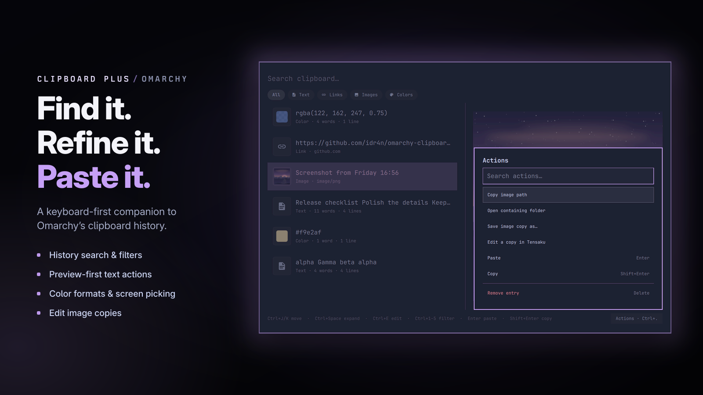

# Clipboard Plus

A keyboard-first overlay for Omarchy Quattro's clipboard history, with type
filters, large text and image previews, color swatches, and inline text
editing.



Clipboard Plus is a UI companion to Omarchy's built-in `omarchy.clipboard`
plugin. It reads the same resident history and uses Omarchy's clipboard
helpers, so it does not start another `wl-paste` watcher or Quickshell process.

## Features

- Search clipboard history by typing
- Navigate with the arrow keys or `Ctrl+J` / `Ctrl+K`
- Filter all entries, text, standalone links, images, or detected CSS colors
- Preview long text, images, and detected colors without leaving the overlay
- Scan two-line rows with type icons, small color swatches, and image thumbnails
- See link domains, word/line counts, file counts/directories, and image MIME types
- Edit text before copying or pasting it
- Paste, copy, open, remove, or clear history entries from the keyboard
- Follow the active Omarchy theme through the shell's shared UI components

## Row details

The result list and preview have equal width without changing the overlay's outer
dimensions. Type icons, small color swatches, and image thumbnails share rounded
frames. Images keep their original corners with a small inset, retain their aspect
ratio, and keep the same text alignment.

Subtitles show full word/line counts for retained text and colors, file counts
and a shared directory when available, link domains, or image MIME. Words are whitespace-delimited;
line counts include an empty final line after a trailing line break. Counts are
computed when history changes, not from the shortened preview or on each search.
Oversized placeholders have no word/line counts. App names, copy ages, and unknown
image dimensions are not guessed.

## Filters and links

Compact All, Text, Links, Images, and Colors pills sit below search. Click a pill
to change category without clearing the query or losing keyboard navigation.
`Ctrl+T` cycles through that order; `Ctrl+Shift+T` cycles backward. The existing
`Ctrl+1` / `2` / `3` / `4` shortcuts still select All / Text / Images / Colors.

Links recognizes complete, trimmed `http://` and `https://` URLs and bare domains
such as `example.com/docs`, up to 8,192 code units. The subtitle shows the host
without user information or a port. URLs embedded in prose, multiple links in
one entry, and incomplete or unsafe values remain Text. Recognized links are
excluded from Text; image URLs remain Links, not local image previews.

Classification makes no network requests. Copy, paste, edit, and `Alt+Enter`
retain the original clipboard value and existing history-index actions.

## Color formats

The Colors filter recognizes whole color values, including:

- `#RGB`, `#RGBA`, `#RRGGBB`, and `#RRGGBBAA` (CSS alpha-last order);
- six- or eight-digit hex without `#`;
- `rgb()` / `rgba()` with numeric or percentage channels, comma notation, or
  modern space/slash notation such as `rgb(100% 0% 0% / 50%)`; and
- `hsl()` / `hsla()` with percentage saturation/lightness and degree, radian,
  gradian, or turn hues, such as `hsla(.5turn 100% 50% / 25%)`.

Compact and expanded color previews show normalized hex, RGB(A), and HSL(A)
values. Transparent colors render over a checkerboard. Copying, pasting, and
editing preserve the original expression rather than using the normalized label.

Malformed values, out-of-range components, and color expressions embedded in
prose remain text. Named colors, CSS variables, and advanced color spaces such
as `oklch()` are not recognized. Legacy comma-separated RGB channels must be
all numeric or all percentages; modern space notation permits mixed channels.

## Requirements

- Omarchy Quattro
- The built-in `omarchy.clipboard` plugin enabled, which is the Omarchy default
- Omarchy's standard clipboard history and helper commands

No additional packages, services, or background processes are required.

## Install

```sh
omarchy plugin add https://github.com/idr4n/omarchy-clipboard-plus.git --enable
```

Clipboard Plus is an overlay and does not install a keybinding. To place it on
`SUPER+CTRL+V` while retaining the stock clipboard on
`SUPER+CTRL+SHIFT+V`, add this to `~/.config/hypr/bindings.lua`:

```lua
hl.unbind("SUPER + CTRL + V")
o.bind(
  "SUPER + CTRL + V",
  "Clipboard Plus",
  "omarchy-shell shell toggle io.github.idr4n.clipboard-plus"
)
o.bind(
  "SUPER + CTRL + SHIFT + V",
  "Clipboard",
  "omarchy-shell shell toggle omarchy.clipboard"
)
```

Apply and validate the binding:

```sh
hyprctl reload
hyprctl configerrors
```

The overlay intentionally uses Omarchy's `omarchy-clipboard` layer-shell
namespace so the stock no-animation rule also applies to Clipboard Plus. The
plugin IDs remain separate; this only shares the compositor rule.

## Keyboard controls

| Key | Action |
| --- | --- |
| Type | Filter entries |
| `Up` / `Down`, `Ctrl+K` / `Ctrl+J` | Move selection |
| `Page Up` / `Page Down`, `Home` / `End` | Move through history |
| `Enter` | Paste the selected entry |
| `Shift+Enter` | Copy without pasting |
| `Alt+Enter` | Open with Omarchy's clipboard opener |
| `Ctrl+Space` | Open or close the expanded preview |
| `Ctrl+E` | Edit the selected text entry |
| `Ctrl+1` / `2` / `3` / `4` | Show all / text / images / colors |
| `Ctrl+T` / `Ctrl+Shift+T` | Cycle filters forward / backward |
| `Ctrl+R` | Reload history from disk |
| `Delete` | Remove the selected history entry |
| `Shift+Delete` | Confirm clearing all history |
| `Escape` | Clear the search, close a detail view, or close the overlay |

In the text editor:

- `Ctrl+Enter` pastes the edited text.
- `Ctrl+Shift+Enter` or `Ctrl+S` copies the edited text.
- `Escape` cancels editing.

## Privacy and permissions

Clipboard Plus runs unsandboxed inside the existing Omarchy shell, as all
Omarchy shell plugins do. It can therefore read clipboard contents, which may
contain sensitive information.

The plugin:

- reads and updates `~/.local/state/omarchy/clipboard-history.json`;
- refuses raw history files over 4 MiB before JSON parsing and retains the
  first 300 disk positions;
- represents individual text entries over 1,048,576 code units as
  metadata-only rows that preserve their disk indices for paste, copy, and
  open while keeping their contents out of search, preview, and editing;
- keeps plugin writes disabled while any oversized placeholder would remain;
  the last one can be deleted directly, while multiple require clearing
  history or removing them with the stock clipboard manager;
- caps aggregate retained text at 4,194,304 code units and rejects
  modifications that would exceed the cap instead of silently dropping entries;
- validates persisted image-entry paths and MIME types before loading previews;
- invokes Omarchy's packaged `omarchy-clipboard-paste-text`,
  `omarchy-clipboard-paste-file`, and `omarchy-clipboard-open` helpers;
- stores edited text as a new stock-format history entry and invokes it by
  history index, so edited clipboard contents are not exposed through process
  arguments;
- makes no network requests;
- requests no elevated privileges; and
- starts no persistent watcher, service, installer, or second Quickshell
  instance.

Removing or clearing entries modifies the history shared with the stock
clipboard manager.

## Remove

First remove the Clipboard Plus binding block from
`~/.config/hypr/bindings.lua` and reload Hyprland. Omarchy's stock
`SUPER+CTRL+V` binding will then be restored from its default configuration.

Remove the plugin:

```sh
omarchy plugin remove io.github.idr4n.clipboard-plus
```

## Development

Run the manifest validator, QML linter, and model tests from the repository
root:

```sh
omarchy plugin validate .
qmllint -I "$OMARCHY_PATH/shell" Clipboard.qml
node tests/clipboard-history.js
```

Before releasing, also exercise open, close, paste, copy, edit, disable,
re-enable, shell restart, and removal against a current Omarchy Quattro
installation.

## Acknowledgements

Clipboard Plus is derived from Omarchy's stock clipboard history model and
overlay, then extended with filtering, expanded previews, and text editing.
The stock Omarchy clipboard
[implementation](https://github.com/basecamp/omarchy/tree/quattro/shell/plugins/clipboard)
is MIT-licensed; `LICENSE` retains its upstream copyright notice.

## License

[MIT](LICENSE)
